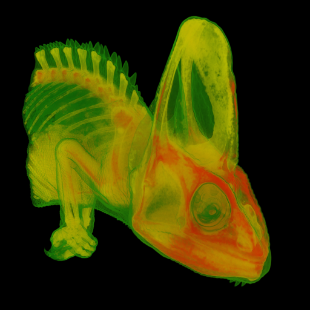
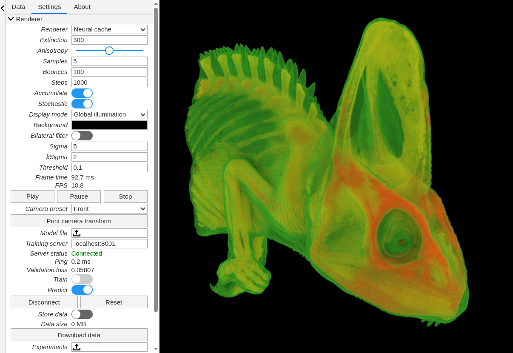

# 💡 Neural Volume Illumination

This repository contains the implementation for the master's thesis
[*Neural caching of dynamic volume illumination*](thesis/Neural_caching_of_dynamic_volume_illumination.pdf)
completed as part of the Data Science master's program at the *Faculty of
Computer and Information Science* in Ljubljana.

<p align="center">
  
</p>

In this thesis, we present an approach for computing global illumination in
volumetric path tracing using neural networks. The indirect illumination part
is computed using a neural network that is trained using ground truth data
generated while rendering a scene with a path tracer.

## Repository Structure

The main components of the repository are organized as follows:

- `data/`: Directories for storing volumetric data and intermediate results.
- `evaluation/`: Scripts and notebooks for the final evaluation.
  - `evaluation/experiments/`: JSON declarations for all experiments.
  - `evaluation/results/`: Results of all experiments.
- `images/`: Experiment and images used in this README.
- `model/`: Scripts and notebooks for the neural network model.
- `thesis/`: LaTeX sources of the thesis, plots, tables and final PDF.
- `web/`: Examples for neural network training and inference in a web browser.
- `vpt/`: Volumetric path tracer implementation.

## VPT

The volumetric path tracer part of the method was implemented in a submodule
repository [vpt](vpt/). It is based on the existing implementation of a path
tracer written in WebGPU.

## Screenshots

<p align="center">
  
</p>

The following video shows the application in use by training a model for
around 1.5 minutes and comparing path tracing and neural rendering.

https://github.com/user-attachments/assets/0c7a15a1-c352-466d-b913-84115f0c373b

## Environment Setup

The implementation is split into Python and JavaScript parts.

For JavaScript, you need `node` and follow instruction in the `vpt/README.md`
to run the path tracer. For development, we can install `nodemon` globally
and run path tracer from this repository as well:

```bash
npm install -g nodemon
nodemon
```

For Python, the virtual environment can be set up using `uv`:

```bash
uv sync
```

## Requirements

To run this method yourself, you will need to obtain raw volumetric datasets
and place them in the `data/volumes/` directory. They can be used in the VPT
renderer or in Python notebooks by settings paths to your desired datasets.

Other data in `data/models/`, `data/radiance/` and `data/images/` can be
obtained by either running scripts or directly from the renderer itself.

## Usage

To use the notebooks and scripts in the `model/` directory, you will have to
obtain a radiance ZIP. It is generated in VPT by enabling the *Store data*
option during rendering and pressing the *Download data* button.

The models exported from the `model/onnx_runtime.ipynb` and
`model/weights_export.ipynb` notebooks can be used in the `web/` directory for
inference by serving the `web/` directory with a local web server.

The renderer is available at [localhost:3000](http://localhost:3000) after
running the `nodemon` command. To be able to connect to the training server,
run it using

```bash
python model/server.py data/configs/model_parameters/gpu.json
```

Additionally, you can add the `--show-images` flag to see the ground truth
data and predictions preview.

## Evaluation

All experiments used for the evaluation are declared in subdirectories of the
`evaluation/experiments/` directory. To run a single or multiple experiments,
you upload it under the *Experiments* option in the renderer.

Each experiment uses local files for volumes, transfer functions and models.
These need to be accessible using a URL which is set in JSON declarations.
The `data/` directory can be served by running

```bash
python evaluation/serve_files.py
```

If a model experiment does not find a model file, it will generate ground
truth radiance ZIP instead.

The `prepare_*.py` scripts are used to copy resulting ZIPs to their respective
directories under `data/` or to generate models that are needed to evaluation.

The `evaluate_*.py` scripts do the evaluation locally.

The notebooks in the `evaluation/` directory are used to view the results. The
`final_*.py` scripts are used to generate all the final results programmatically.

## Disclaimer

The [Claude Code](https://claude.com/claude-code) tool was used during the
implementation of this thesis.
